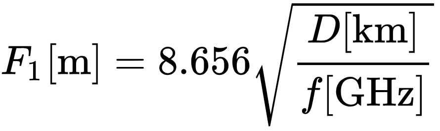

# Cálculo de la Zona de Fresnel

Este proyecto es una aplicación web sencilla desarrollada en JavaScript y HTML estilado con Tailwind que permite calcular la primera zona de Fresnel. La zona de Fresnel es una región elíptica alrededor de la línea de visión directa entre un transmisor y un receptor, importante en el diseño de sistemas de comunicación inalámbrica. Puedes consultar [Wikipedia](https://es.wikipedia.org/wiki/Zona_de_Fresnel) para más información.

Este sitio fue realizada para un trabajo de la materia de Redes a cargo del profesor Ariel Dellafiore, como parte de la tecnicatura de Desarrollo de Software de Itec Río Cuarto. 

## Cálculo

Ingresando la frecuencia y la distancia, la aplicación calcula el radio de la primera zona de Fresnel.
La fórmula empleada es la siguiente: 

  

donde:
- **F₁** es el radio de la primera zona de Fresnel, expresado en metros
- **D** es la distancia entre las antenas en kilómetros
- ***f*** es la frecuencia expresada en Gigahercios

## Uso
- Ingresa al [sitio web de la calculadora](https://faculemo.github.io/Calculadora-de-Fresnel/) (o, alternativamente, clona el repositorio y ejecuta "index.html")
- Completa los campos ingresando distancia y frecuencia
- Haz click en "calcular"

## Licencia
[CC-BY](https://creativecommons.org/licenses/by/4.0/deed.es). 
Facundo Esteban Lemo, 2024
